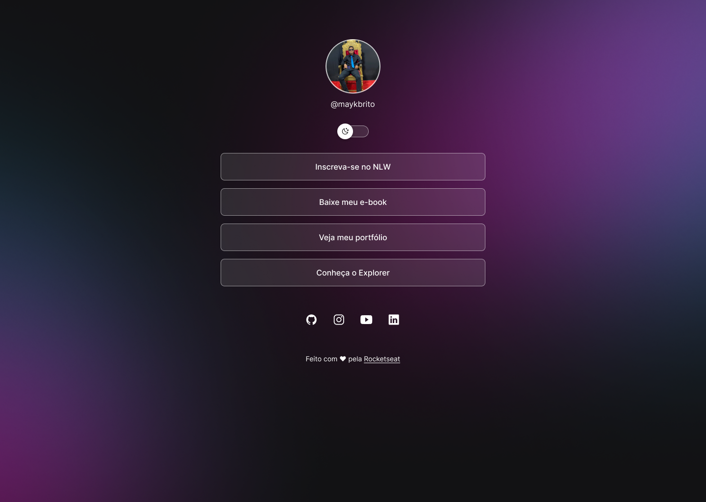

<h1 align="center"> DevLinks </h1>

Landing page responsiva para divulgar alguns links legais desta lenda viva em pessoa.

  <a href="#-tecnologias">Tecnologias</a>&nbsp;&nbsp;&nbsp;|&nbsp;&nbsp;&nbsp;
  <a href="#-projeto">Projeto</a>&nbsp;&nbsp;&nbsp;|&nbsp;&nbsp;&nbsp;
  <a href="#-layout">Layout</a>&nbsp;&nbsp;&nbsp;|&nbsp;&nbsp;&nbsp;
  <a href="#memo-licença">Licença</a>

  

 

  

## 🚀 Tecnologias

Este projeto foi desenvolvido com as seguintes tecnologias:

- HTML e CSS
- JavaScript
- Git e Github
- Figma

## 💻 Projeto

Esta web page foi desenvolvidade durante um programa online e gratuito da [Rocketseat](https://www.rocketseat.com.br) com o intuito pessoal de ampliar meus conhecimentos com tecnologias web de front-end e aprender alguns truques novos.

## 🔖 Layout mobile

Você pode visualizar o layout do projeto com mais detalhes através [DESSE LINK](https://www.figma.com/file/BZxdGQd1XC9uL7F7qKvede/DevLinks?type=design&node-id=0-1&mode=design&t=wUtVHwKAfddlpsCW-0). É necessário ter conta no [Figma](https://figma.com) para acessá-lo.

## :memo: Licença

Esse projeto está sob a licença MIT.

---

Feito com ♥ junto com a [Rocketseat](https://www.rocketseat.com.br)
